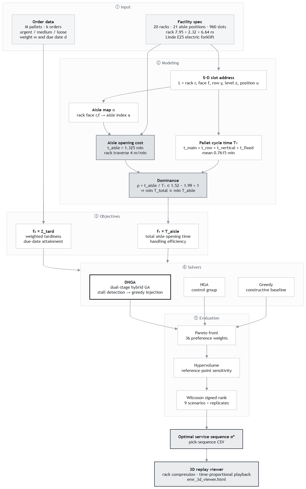

# EMR Picking Sequence Optimizer

*[中文版本](README.zh-TW.md)*

> Scheduling engine and 3D replay for dense mobile rack warehouses — where opening an aisle costs 1.74× more than picking a pallet.

**Live Demo → [wutesta0101-hue.github.io/emr-scheduling](https://wutesta0101-hue.github.io/emr-scheduling)**


---

## What It Does

Given a set of pallets to retrieve from a 960-slot mobile rack warehouse, the engine produces a service sequence that minimizes handling time and due-date violation simultaneously — then replays it in 3D so the result can be inspected rather than trusted.

- **Bi-objective optimization** — aisle switching cost against weighted tardiness, solved with a dual-stage hybrid genetic algorithm
- **Physically grounded cost model** — every time coefficient derived from published Linde E25 specifications, not fitted
- **Interactive 3D replay** — drop a sequence CSV in and watch the racks compress, the aisle open, and the forklift wait
- **Time-proportional playback** — screen time scales with simulated time, so the cost structure is visible rather than described

---

## The Constraint That Drives Everything

Racks in a dense mobile system sit flush against one another. To reach any pallet you must first drive the racks apart, and only one aisle can exist at a time.

$$\rho = \frac{t_{aisle}}{\mathbb{E}[T_1]} = \frac{1.325}{0.7615} = 1.74$$

Opening an aisle costs 1.74× more than picking a pallet. One consequence: minimizing total handling time reduces to minimizing aisle switches. The whole scheduling problem follows from that.

---

## Results

Four algorithms, nine warehouse scenarios, 36 preference weightings, 32,400 runs.

| | |
|---|---|
| **Only DHGA exposes the trade-off** | DHGA returns **12.4** non-dominated solutions across the preference sweep; HGA 7.1, Greedy 2.2, GA 1.3. Under Greedy the two objectives correlate at **+0.99** — there is nothing left to trade off. |
| **The gap widens with scale** | Hypervolume improvement over the next-best method rises from **+2.9%** at 288 pallets to **+6.3%** at 672. All nine scenarios agree. |
| **Without costing time** | DHGA averages **94.0 s** against 99.3 s and 101.3 s for the comparison methods — 5.3% faster while producing richer fronts. |
| **Near the theoretical floor** | On the bundled 288-pallet instance the solution makes **23 aisle switches** against a hard lower bound of 20 — **15%** above optimal. |

---

## How It Works

### Slot addressing

Every pallet position carries a five-dimensional address $L = (r, f, y, z, u)$ — rack, face, row, level, position:

$$\underbrace{20}_{\text{racks}} \times \underbrace{2}_{\text{faces}} \times \underbrace{3}_{\text{rows}} \times \underbrace{4}_{\text{levels}} \times \underbrace{2}_{\text{positions}} = 960 \text{ slots}$$


Twenty racks on floor rails, 54.70 m × 11.95 m clear. Whichever aisle is open, the footprint is identical — that invariance is what "dense storage" means.

$$\underbrace{20 \times 2.32}_{\text{racks}} + \underbrace{20 \times 0.15}_{\text{clearance}} + \underbrace{5.30}_{\text{open aisle}} = 54.70 \text{ m}$$

The plan resolves `r` and `f`. The remaining three dimensions live on the rack face:


Three rows of 2.65 m, each split into two 1.325 m positions, stacked four levels of 1.66 m. The highlighted slot is **(13, A, 1, 3, 1)** — the same slot the viewer reports as `13A 1/3/1`:


### Cost model — derived from Linde E25 specifications

| Motion | Rated speed | Derived coefficient |
|---|---|---|
| Travel | 250 m/min | $t_{main} = 0.01856\,r$ |
| Row traverse | 250 m/min | $t_{row} = 0.0212(y{-}1) + 0.0106(u{-}1)$ |
| Lift / lower | 26 / 34 m/min | $t_{vertical} = 0.1126(z{-}1)$ |
| Rack traverse | 4 m/min | $t_{aisle} = 1.325$ min |

Pallet cycle time is the sum of these plus a fixed handling term. No coefficient is tuned against observed data — the model predicts the measurements rather than reproducing them.

### Algorithm — DHGA

A dual-stage hybrid genetic algorithm over permutation encodings of the service sequence. Standard GA machinery — tournament selection, order crossover, elitism — with one addition that accounts for the performance gap:

**Stall detection with greedy injection.** When the best objective value fails to improve for $G_{stall}$ generations, a fraction of the non-elite population is replaced by solutions built from a greedy aisle-grouping heuristic. This re-seeds diversity in the region of the search space that matters — sequences that already cluster picks by aisle — instead of restarting blindly.

Selection is driven by a weighted objective over normalized aisle cost and normalized tardiness; sweeping the weighting produces the Pareto front. Fronts are compared by hypervolume and tested across scenarios with a Wilcoxon signed-rank test.

### Pipeline



---

## Tech Stack

| Layer | Technology |
|---|---|
| Viewer | Three.js r128 (custom orbit controls), vanilla JS, single file |
| Rendering | InstancedMesh for 960 slots, tweened rack compression, MediaRecorder export |
| Experiment platform | Alpine.js front end, Node.js worker pool (up to 88 parallel) |
| Analysis | Hypervolume, Wilcoxon signed-rank, reference-point sensitivity |
| Drawings | AutoCAD (plan, elevation) |

---

## Quick Start

No build step, no server, no install.

```
git clone https://github.com/wutesta0101-hue/emr-scheduling.git
```

Open `viewer/emr_3d_viewer.html` in any browser, or use the [live demo](https://wutesta0101-hue.github.io/emr-scheduling).

**To see the point in thirty seconds:** click **Demo · Scattered**, then **Demo · Grouped**. Identical pallets in identical slots, different service order. Watch the amber bar.

**With real solutions:** load `data/best_pick_sequence_Greedy_M288_K21.csv`, then the DHGA file. The forklift idles at the I/O point while the racks grind apart — the amber segment of the cost bar is that idle time accumulating.

### Controls

| | |
|---|---|
| `Space` | play / pause |
| `←` `→` | single step |
| Time scale | 0.2 – 300 simulated minutes per real second |
| Cameras | isometric · plan · elevation |
| Export | WebM recording, PNG snapshot |

---

## Input Format

| Column | Meaning |
|---|---|
| `seq_pos` | position in the service sequence |
| `pid`, `order` | pallet id, parent order |
| `a` | aisle that must be open for this pick |
| `r`, `f`, `y`, `z`, `u` | five-dimensional slot address |
| `T1` | pallet cycle time (min) |
| `class`, `weight`, `deadline` | urgency class, priority weight, due date |
| `aisle_switch` | 1 if this pick requires opening a different aisle |
| `cum_time_end` | cumulative completion time (min) |

Facility dimensions are inferred from the data — rack count, rows, levels and positions are read from the largest indices present in the file.

```
emr-scheduling/
├── viewer/
│   └── emr_3d_viewer.html
├── data/
│   ├── best_pick_sequence_DHGA_M288_K21.csv
│   └── best_pick_sequence_Greedy_M288_K21.csv
└── docs/
    ├── hero.png
    ├── plan_view.png
    ├── elevation.png
    ├── slot_addressing.png
    └── architecture_en.png
```

---

## Background

M.S. thesis work, Software Engineering & Management, National Kaohsiung Normal University, 2026.

A companion project, [container-packing](https://github.com/wutesta0101-hue/container-packing), solves the spatial half of the same family — 3D bin-packing under forklift aisle clearance constraints. Same forklift, same accessibility constraint, opposite decision variable: one decides *where things go*, the other decides *what order to reach them in*.

**License** — code MIT, data and figures CC BY 4.0
