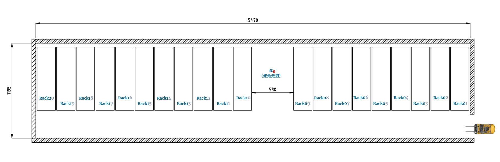
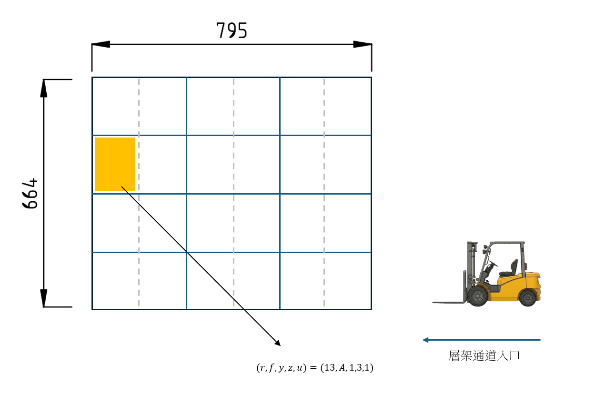
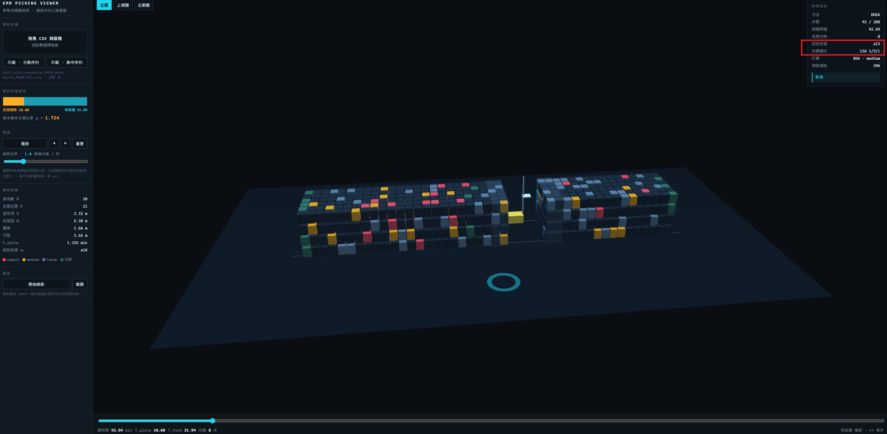

# 密集式移動貨架 揀貨序列最佳化

*[English](README.md)*

> 密集式移動貨架倉儲的排程引擎與三維重播——在這裡,開一條走道的成本是揀一個棧板的 1.74 倍。

**線上展示 → [wutesta0101-hue.github.io/emr-scheduling](https://wutesta0101-hue.github.io/emr-scheduling)**


---

## 這個系統做什麼

給定一批要從 960 儲位移動貨架倉庫取出的棧板,引擎產生一組同時最小化搬運時間與交期違約的服務序列,並以三維重播呈現——讓結果可以被**3D可視化**檢視。

- **雙目標最佳化** — 貨架走道切換成本與訂單權逾期,以雙階段混合遺傳演算法求解
- **物理錨定的成本模型** — 每一項時間係數皆由 Linde E25 公開規格推導,而非配適
- **互動式三維重播** — 拖入序列 CSV,即可看見貨架、走道開啟、堆高機等待
- **時間比例播放** — 畫面時長與模擬時間等比,成本結構是看得見的

---

## 驅動一切的那個約束

密集式系統的貨架彼此緊貼。要取到任何棧板,必須先把貨架推開,而且同一時間只能存在一條走道。

$$\rho = \frac{t_{aisle}}{\mathbb{E}[T_1]} = \frac{1.325}{0.7615} = 1.74$$

開一條走道的成本是揀一個棧板的 1.74 倍。一個直接推論:最小化總搬運時間,可化約為最小化走道切換次數。整個排程問題由此而生。

---

## 成果

四種演算法、九種倉儲情境、36 組偏好權重、32,400 次執行。

| | |
|---|---|
| **只有 DHGA 展開了取捨** | DHGA 在偏好掃描下產出 **12.4** 個非支配解,HGA 7.1、Greedy 2.2、GA 1.3。Greedy 的兩個目標相關係數達 **+0.99**——根本沒有取捨可言。 |
| **差距隨規模擴大** | 相對次佳方法的 Hypervolume 改善,由 288 棧板時的 **+2.9%** 升至 672 棧板時的 **+6.3%**,九個情境結論一致。 |
| **而且沒有付出時間代價** | DHGA 平均 **94.0 秒**,對照方法為 99.3 與 101.3 秒——快 5.3%,同時給出更豐富的前緣。 |
| **逼近理論下限** | 在附帶的 288 棧板實例中,解只切換 **23 次**走道,硬下界為 20 次——僅高出 **15%**。 |

---

## 運作方式

### 儲位定址

每個棧板位置都有一組五維座標 $L = (r, f, y, z, u)$——貨架、面別、行、層、位:

$$\underbrace{20}_{\text{貨架}} \times \underbrace{2}_{\text{面}} \times \underbrace{3}_{\text{行}} \times \underbrace{4}_{\text{層}} \times \underbrace{2}_{\text{位}} = 960 \text{ 儲位}$$



二十座軌道式貨架,淨尺寸 54.70 m × 11.95 m。無論開啟哪一條走道,佔地完全相同——這個不變性就是「密集式儲存」的意思。

$$\underbrace{20 \times 2.32}_{\text{貨架}} + \underbrace{20 \times 0.15}_{\text{滑行餘隙}} + \underbrace{5.30}_{\text{開啟走道}} = 54.70 \text{ m}$$

立面圖解析 `r` 與 `f`,其餘三個維度存在於貨架面上:



三行各 2.65 m,每行分為兩個 1.325 m 的儲位,垂直堆疊四層各 1.66 m。圖中標示的儲位為 **(13, A, 1, 3, 1)**——即3D視圖顯示的 `13A 1/3/1`:



### 成本模型 — 由 Linde E25 規格推導

| 動作 | 額定速度 | 推導係數 |
|---|---|---|
| 行進 | 250 m/min | $t_{main} = 0.01856\,r$ |
| 行內橫移 | 250 m/min | $t_{row} = 0.0212(y{-}1) + 0.0106(u{-}1)$ |
| 揚升 / 下降 | 26 / 34 m/min | $t_{vertical} = 0.1126(z{-}1)$ |
| 貨架平移 | 4 m/min | $t_{aisle} = 1.325$ min |

單棧板作業時間為上述各項加上固定作業時間，每一個值都來自技術文件。

### 目標函數

$$\min_{\sigma \in \text{Perm}(P(X))} \text{score}(\sigma; X) = \alpha \cdot \widehat{Z}_{tard}(\sigma) + \gamma \cdot \widehat{T}_{aisle}(\sigma; X)$$

| 符號 | 代表意義 |
|---|---|
| $\alpha$ | 加權逾期項的偏好權重,值越大代表決策者越重視訂單準時性 |
| $\widehat{Z}_{tard}(\sigma)$ | 正規化加權逾期總量（$\in [0,1]$）,衡量序列 $\sigma$ 使各訂單超過截止時間所造成的加權延遲成本 |
| $\gamma$ | 走道成本項的偏好權重,值越大代表決策者越重視走道切換效率 |
| $\widehat{T}_{aisle}(\sigma; X)$ | 正規化走道開啟時間（$\in [0,1]$）,衡量序列 $\sigma$ 於情境 $X$ 下所需之走道切換總成本 |

掃描 $(\alpha, \gamma)$ 之 36 組偏好權重組合,即得雙目標之 Pareto 前緣。

### 演算法 — DHGA

以服務序列的排列編碼為基礎的雙階段混合遺傳演算法。標準 GA 機制(競賽選擇、順序交配、菁英保留)之外,加上一項解釋了效能差距的設計:

**停滯偵測與 Greedy 注入。** 當最佳目標值連續 $G_{stall}$ 代未改善時,以走道分群啟發式建構的解替換部分非菁英個體。這讓多樣性在**真正重要的搜尋區域**重新播種——也就是已經依走道群聚的序列。

選擇由正規化走道成本與正規化逾期量的加權目標驅動;掃描權重即得 Pareto 前緣。前緣以 Hypervolume 比較,並跨情境以 Wilcoxon 符號檢定驗證。

```
Initialize:
  σ_greedy ← Greedy(P(X))
  P⁽⁰⁾ ← {σ_greedy} ∪ {σ_greedy 之 swap mutation 擾動版本}
  stall ← 0

while g < G and stall < G_stall:
  對 P⁽ᵍ⁾ 中每個個體評估 score(σ; X)
  elite ← score 最小之前 E 個個體

  if stall ≥ G_stall:                     # 動態 Greedy 注入
      以 {σ_greedy} ∪ {擾動版本} 取代非菁英個體
      stall ← 0

  for 其餘族群位置:
      parent1, parent2 ← TournamentSelect(P⁽ᵍ⁾)
      child ← OrderCrossover(parent1, parent2)
      child ← SwapMutation(child)

  P⁽ᵍ⁺¹⁾ ← elite ∪ 新產生之子代
  stall ← 若最佳 score 未改善則 +1,否則歸零
  g ← g + 1

return σ* ← argmin score(σ; X), σ ∈ P⁽ᵍ⁾
```

### 系統架構


---

## 技術組成

| 層 | 技術 |
|---|---|
| 檢視器 | Three.js r128(自刻 orbit controls)、原生 JS、單一檔案 |
| 實驗 | Node.js、Javascript |
| 分析 | Hypervolume、Wilcoxon 符號檢定、參考點敏感度 |
| 渲染 | 960 儲位以 InstancedMesh 繪製、貨架壓縮補間動畫、MediaRecorder 匯出 |
| 圖面 | AutoCAD(平面圖、立面圖) |

---

## 快速開始

免建置、免伺服器、免安裝。

```
git clone https://github.com/wutesta0101-hue/emr-scheduling.git
```

用任何瀏覽器開啟 `index.html`,或直接使用[線上展示](https://wutesta0101-hue.github.io/emr-scheduling)。

**三十秒看懂重點:** 按「示範 · 分散序列」,再按「示範 · 集中序列」。同樣的棧板、同樣的儲位,只有服務順序不同。注意那條琥珀色的條。

**用真實解:** 先載入 `data/best_pick_sequence_Greedy_M288_K21.csv`,再載入 DHGA 那份。堆高機會停在 I/O 點乾等貨架滑開——成本條上的琥珀色段落,就是那段等待在累積。

### 操作

| | |
|---|---|
| `空白鍵` | 播放 / 暫停 |
| `←` `→` | 單步 |
| 縮時倍率 | 0.2 – 300 模擬分鐘 / 真實秒 |
| 鏡頭 | 立體 · 上視圖 · 立面圖 |
| 輸出 | WebM 錄影、PNG 截圖 |

---

## 參數說明

| 欄位 | 意義 |
|---|---|
| `seq_pos` | 在服務序列中的位置 |
| `pid`, `order` | 棧板編號、所屬訂單 |
| `a` | 本次揀取所需開啟的走道 |
| `r`, `f`, `y`, `z`, `u` | 五維儲位座標 |
| `T1` | 單棧板作業時間(分鐘) |
| `class`, `weight`, `deadline` | 緊急類別、優先權重、截止時間 |
| `aisle_switch` | 本次是否需要切換走道(1 = 是) |
| `cum_time_end` | 累計完成時間(分鐘) |

場域尺寸自資料推斷——貨架數、行數、層數與每格儲位數,取自檔案中出現過的最大索引。

```
emr-scheduling/
├── index.html
├── data/
│   ├── best_pick_sequence_DHGA_M288_K21.csv
│   └── best_pick_sequence_Greedy_M288_K21.csv
└── docs/
    ├── hero.png
    ├── plan_view.png
    ├── elevation.png
    ├── slot_addressing.png
    └── architecture.png
```

---

## 3D可視化及來源依據

國立高雄師範大學 軟體工程與管理學系 碩士論文,2026。

## 相關專案

**[三維貨櫃裝箱系統](https://github.com/wutesta0101-hue/container-packing)** — 模擬堆高機物於貨櫃內裝疊貨物的**物理行為**。

**[貨櫃追蹤器](https://github.com/wutesta0101-hue/container-arrival-tracker)** — 零基礎設施的貨櫃到貨追蹤工具,串接倉庫、報關與採購三個部門。

---

**授權** — © 2026 Testa Wu。保留所有權利。僅供作品展示用途。
